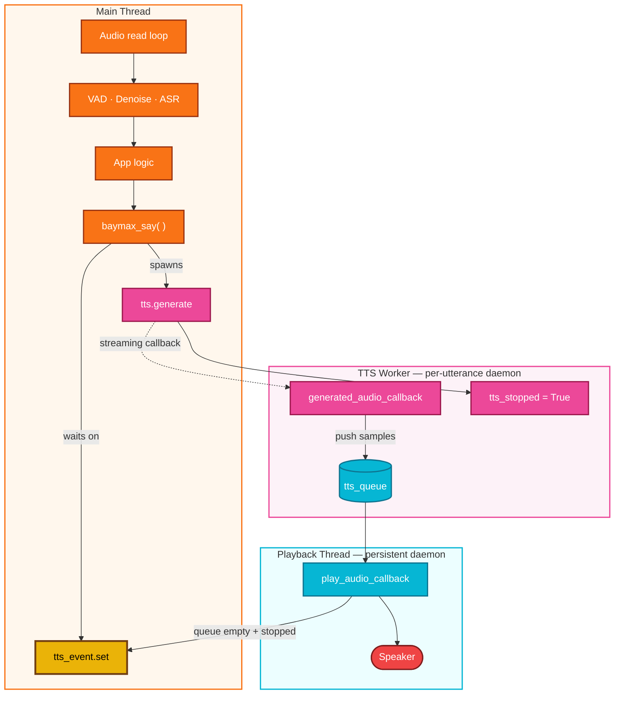
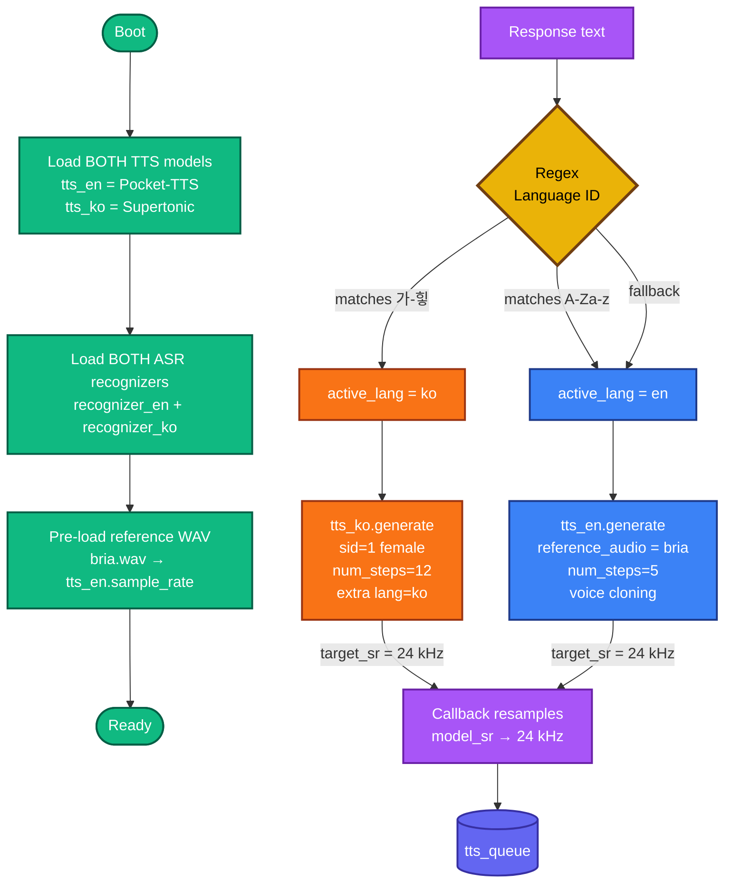
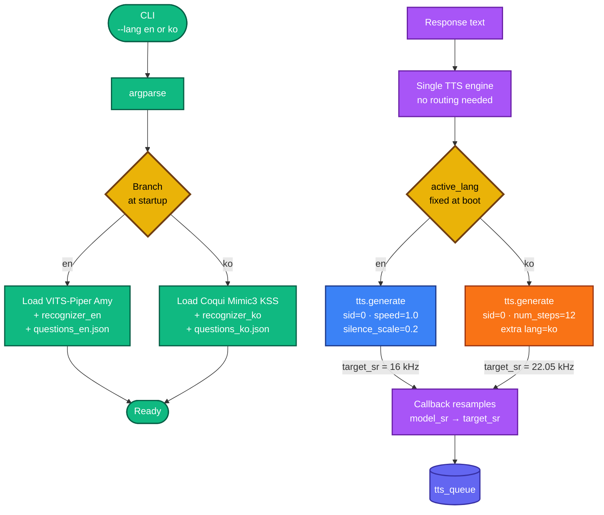

# Baymax — Real-Time On-Device STT ↔ TTS Voice Pipeline

A fully offline, low-latency, full-duplex voice interaction stack built on top of [sherpa-onnx](https://github.com/k2-fsa/sherpa-onnx), designed to run end-to-end on a **Raspberry Pi**. The implementation shipped in this repo drives a bilingual (English / Korean) interactive quiz, but the underlying architecture is **application-agnostic** — any module that consumes transcribed text and produces a response string (chatbot, agent, RAG pipeline, IVR, robotics command parser, …) can be dropped into the *Application Logic* slot without touching the audio plumbing.

Two variants are provided, both Pi-native, optimized for different points on the Pi performance curve:

| File | Pi Target | Languages | TTS Models Resident | Memory | Use Case |
|---|---|---|---|---|---|
| `baymax.py` | **Pi 5 (8 GB)** / Pi 4 (8 GB) | English **and** Korean (per-utterance switching) | 2 simultaneously | Higher | Bilingual sessions, voice cloning |
| `baymax-lite.py` | **Pi 4 (4 GB)** / Pi Zero 2 W / Pi 3 | English **or** Korean (chosen at startup) | 1 | Lower | Resource-constrained Pi deployment |

---

## 1. Shared Pipeline (Common to Both Variants)

Both variants share the same end-to-end signal flow. The only thing that changes between them is **how the TTS leg is configured and routed**.

```mermaid
flowchart LR
    MIC([Microphone<br/>48 kHz mono]) --> READ[InputStream<br/>100 ms reads]
    READ --> RS1[Linear-Interp<br/>Resampler<br/>48k → 16k]
    RS1 --> VAD[Silero VAD<br/>min_silence = 0.3 s<br/>buffer = 10 s]
    VAD -->|segment > 0.5 s| DEN[GTCRN<br/>Speech Denoiser]
    DEN --> ASR[SenseVoice ASR<br/>int8, multilingual<br/>zh / en / ja / ko / yue]
    ASR -->|transcript| APP{{Application<br/>Logic}}
    APP -->|response text| TTS[TTS Engine]
    TTS -.->|streaming chunks<br/>via callback| RS2[On-the-fly<br/>Resampler]
    RS2 --> Q[(FIFO<br/>tts_queue)]
    Q --> OUT[OutputStream<br/>callback]
    OUT --> SPK([Speaker])

    OUT -.->|tts_event| APP
    APP -.->|mic pause / resume| READ

    classDef capture fill:#06b6d4,stroke:#0e7490,stroke-width:2px,color:#fff
    classDef process fill:#a855f7,stroke:#6b21a8,stroke-width:2px,color:#fff
    classDef asr  fill:#10b981,stroke:#065f46,stroke-width:2px,color:#fff
    classDef app  fill:#f97316,stroke:#9a3412,stroke-width:3px,color:#fff
    classDef tts  fill:#ec4899,stroke:#9d174d,stroke-width:2px,color:#fff
    classDef out  fill:#6366f1,stroke:#3730a3,stroke-width:2px,color:#fff
    classDef dev  fill:#ef4444,stroke:#7f1d1d,stroke-width:2px,color:#fff

    class MIC,SPK dev
    class READ,RS1 capture
    class VAD,DEN process
    class ASR asr
    class APP app
    class TTS,RS2 tts
    class Q,OUT out
```

### Stage-by-stage breakdown

| Stage | Component | Purpose |
|---|---|---|
| **Capture** | `sounddevice.InputStream` | 48 kHz mono float32, 100 ms chunks |
| **Pre-resample** | `np.interp` | Down-samples to 16 kHz (the rate every downstream model expects) |
| **VAD** | Silero VAD ONNX | Endpoints utterances; only emits segments — no streaming-to-ASR overhead |
| **Denoise** | GTCRN | Single-threaded, lightweight; cleans far-field / noisy mic capture |
| **ASR** | SenseVoice (int8) | One multilingual model; recognizer instance is per-language at construction (controls token decoding) |
| **App** | *Your code* | Receives `str`, returns `str` — totally decoupled from audio |
| **TTS** | Variant-specific (see §2 & §3) | Synthesizes response with a streaming callback so playback starts before generation finishes |
| **Post-resample** | `np.interp` | Aligns each model's native rate to the playback stream's fixed rate |
| **Playback** | `sounddevice.OutputStream` | Persistent thread, consumes from queue via callback |

### Concurrency model

Two design choices worth highlighting:

1. **The playback `OutputStream` is opened once at startup and kept alive** for the entire session. Opening/closing the audio device per utterance triggers a driver handshake (50–200 ms on Linux/ALSA) that would dominate the *time-to-first-sound* on a Pi. The stream simply outputs silence when the queue is empty.
2. **The mic `InputStream` is hard-stopped during TTS** (`stream.stop()` → `stream.start()`). This is a stronger guarantee than the `is_speaking` software flag: it prevents the AEC-less Pi mic from picking up the speaker's own output and re-entering the VAD.

---

## 2. Variant A — `baymax.py` (Dual-Language Adaptive, Pi 5 / 8 GB)

Both TTS engines and both ASR recognizers are loaded into memory at boot. For every response string, a tiny regex classifier picks the right TTS on the fly, enabling **per-utterance language switching within a single session**. This is the higher-RAM variant — keep it on a Pi 5 (or 8 GB Pi 4).

**Characteristics**

- **Voice cloning** — Pocket-TTS accepts the reference WAV (`bria.wav`) and clones the speaker's timbre for English output. The reference is resampled once at boot to `tts_en.sample_rate`.
- **Higher quality, higher cost** — Pocket-TTS (LM-flow + main LM + encoder/decoder + text conditioner) and Supertonic (duration predictor + text encoder + vector estimator + vocoder) together push RAM and CPU. `num_threads = 3` on each.
- **Unified playback rate of 24 kHz** — the per-utterance resample in the callback hides the fact that the two engines run at different native rates.
- **`swap_tts_model()` is defined but unused** — kept for an alternative single-resident strategy where models are loaded/unloaded with `gc.collect()` between turns. Trades RAM for the cost of cold-loading on every language flip — useful if you ever want to back-port Variant A's bilingual behavior to a lower-RAM Pi.

---

## 3. Variant B — `baymax-lite.py` (Single-Language Lightweight, Pi 4 / Zero 2 W)

The target language is fixed at process start via a CLI flag. Exactly one TTS and one ASR are ever instantiated. No regex classifier, no swap logic, no reference audio path. This is the variant to reach for on a 4 GB Pi 4, Pi Zero 2 W, or any constrained Pi.

**Characteristics**

- **Tiny resident footprint** — VITS-Piper Amy (~63 MB) or Coqui Mimic3 KSS (~30 MB) are an order of magnitude smaller than their Variant A counterparts. Comfortable on a 4 GB Pi 4 alongside the OS and ASR.
- **No voice cloning** — uses the fixed speaker baked into the model (`sid=0`).
- **Playback rate matches the model's native rate** — the `OutputStream` is opened with `tts.sample_rate`, so the on-the-fly resampler in the callback is a no-op for the common case. Korean (22.05 kHz) and English (16 kHz) sessions therefore use different output stream rates, set once at boot.
- **Boot time** — roughly a third of Variant A because only one TTS graph is loaded.

---

## 4. Side-by-Side Comparison

| Dimension | `baymax.py` (Variant A) | `baymax-lite.py` (Variant B) |
|---|---|---|
| **Pi target** | Pi 5 (8 GB) / Pi 4 (8 GB) | Pi 4 (4 GB) / Pi Zero 2 W / Pi 3 |
| **Language model** | Bilingual, in-session switching | Monolingual, fixed at startup |
| **Language selection** | Regex over response text per utterance | CLI flag `--lang en\|ko` |
| **Resident TTS models** | 2 (Pocket-TTS + Supertonic) | 1 (VITS-Piper *or* Coqui Mimic3) |
| **Resident ASR models** | 2 (en + ko SenseVoice instances) | 1 |
| **Voice cloning** | ✅ Pocket-TTS w/ reference WAV | ❌ |
| **TTS native rates** | 24 kHz (Pocket) · varies (Supertonic) | 16 kHz (Piper) · 22.05 kHz (Mimic3) |
| **Playback stream rate** | Fixed at 24 kHz | Matches selected TTS native rate |
| **English `num_steps`** | 5 (diffusion-style) | n/a (VITS is single-pass) |
| **Korean `num_steps`** | 12 | 12 |
| **TTS threads** | 3 per engine | 3–4 |
| **Approx. RAM** | High | Low |
| **Approx. cold boot** | Slowest leg dominates | Fast |

---

## 5. Model Reference

All models are ONNX, runnable on CPU with no accelerator required — they're all sized to fit on a Pi.

| Role | Model | Notes |
|---|---|---|
| VAD | `silero_vad.onnx` | Shared |
| Denoiser | `gtcrn_simple.onnx` | Shared |
| ASR | `sherpa-onnx-sense-voice-…-2024-07-17` (int8) | Shared; multilingual |
| TTS — EN (A) | `sherpa-onnx-pocket-tts-int8-2026-01-26` | LM-flow + LM-main + enc/dec + text-conditioner; voice cloning |
| TTS — KO (A) | `sherpa-onnx-supertonic-3-tts-int8-2026-05-11` | Duration predictor + text encoder + vector estimator + vocoder |
| TTS — EN (B) | `vits-piper-en_US-amy-low` | Single-file VITS, espeak-ng phonemizer |
| TTS — KO (B) | `vits-mimic3-ko_KO-kss_low` | Single-file VITS, espeak-ng phonemizer |
| LID (optional) | `sherpa-onnx-whisper-tiny` | Defined via `whisper_multilingual()` — not wired into the active code path; available if a regex classifier is insufficient |

All download URLs are inlined as comments in the configuration block at the top of each script.

---

## 6. Tuning Knobs

| Knob | Where | Effect |
|---|---|---|
| `min_silence_duration` | `vad_config.silero_vad` | Lower → faster endpointing, more false cuts |
| `buffer_size_in_seconds` | `VoiceActivityDetector` | Max single-utterance length |
| Min segment length (`> 8000`) | ASR gate | Drops sub-half-second blips |
| `num_threads` (per model) | each `create_*` | Trade latency vs. CPU contention on Pi's 4 cores |
| `num_steps` | TTS `GenerationConfig` | Quality vs. generation speed |
| `silence_scale` *(Variant B)* | TTS `GenerationConfig` | Inter-token pause length |
| `speed` *(Variant B)* | TTS `GenerationConfig` | Playback tempo |
| Mic input rate | `mic_sample_rate` | Set to whatever the USB / I²S mic supports natively; 48 kHz is universally safe |
| Output `blocksize` | `sd.OutputStream` | Smaller → lower latency, higher callback rate |

---

## 7. Adapting to a New Application

Replace the quiz loop inside `main()` with any function that:

1. Receives `reply: str` from the ASR stage,
2. Produces a `response: str`,
3. Calls `baymax_say(response, reference_audio, s)`.

Everything else — capture, VAD, denoise, ASR, TTS, queueing, playback, mic-mute-during-speech — is reusable verbatim.