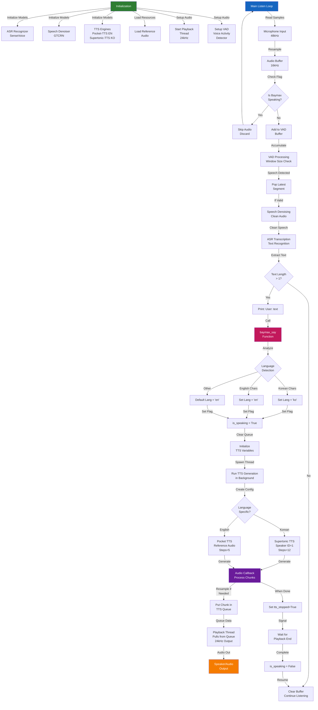
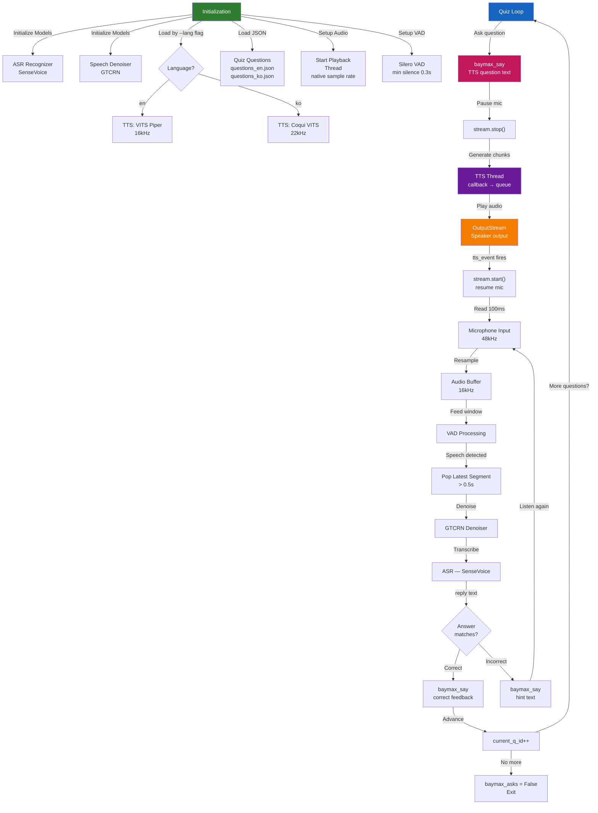

# Baymax Real-Time Speech Interaction Workflow

This document describes the complete workflow of the Baymax speech interaction algorithm implemented in `baymax.py`.

## System Architecture



## Component Overview

### Initialization Phase
- **ASR Recognizer**: SenseVoice model for multi-language speech recognition (supports Chinese, English, Japanese, Korean, Cantonese)
- **Speech Denoiser**: GTCRN model for noise reduction from microphone input
- **TTS Engines**: 
  - Pocket-TTS for English (voice cloning with reference audio)
  - Supertonic-TTS for Korean (multi-speaker support)
- **VAD (Voice Activity Detector)**: Silero VAD for detecting speech segments
- **Playback Thread**: Persistent 24kHz audio stream to avoid driver handshake delays

### Audio Processing Pipeline

1. **Input**: Microphone at 48kHz
2. **Resample**: Convert to 16kHz for processing
3. **VAD**: Detect speech activity and buffer audio
4. **Denoising**: Clean audio using GTCRN model
5. **ASR**: Transcribe to text using SenseVoice
6. **Language Detection**: Analyze text for Korean/English characters
7. **TTS Generation**: Generate response in detected language (threaded, non-blocking)
8. **Resampling**: Convert to 24kHz for consistent playback
9. **Playback**: Stream audio chunks in real-time

### Key Features

- **Echo Prevention**: `is_speaking` flag prevents the microphone from picking up Baymax's own output
- **Multi-threaded**: TTS generation runs in background thread for responsive listening
- **Dual-language Support**: Automatic language detection and model swapping
- **Memory Optimization**: Manual garbage collection when swapping TTS models
- **Real-time Streaming**: Queue-based audio chunk processing for low-latency response

### Threading Model

- **Main Thread**: Handles microphone input, VAD, denoising, and ASR
- **Playback Thread**: Dedicated stream for audio output (always running)
- **TTS Generation Thread**: Spawned per utterance for non-blocking speech generation

## Configuration

### Audio Parameters
- Microphone Input: 48 kHz
- Processing: 16 kHz
- Playback: 24 kHz
- Block Size: 1024 samples

### Model Paths
- VAD: `./silero_vad.onnx`
- ASR: `./sherpa-onnx-sense-voice-zh-en-ja-ko-yue-2024-07-17/`
- Denoiser: `./gtcrn_simple.onnx`
- Pocket-TTS: `./sherpa-onnx-pocket-tts-int8-2026-01-26/`
- Supertonic-TTS: `./sherpa-onnx-supertonic-3-tts-int8-2026-05-11/`

### TTS Configuration
- **English**: Reference-based voice cloning (5 generation steps)
- **Korean**: Supertonic with female speaker (12 generation steps)

---

# Baymax Lite — Quiz Mode Workflow

This section describes the workflow of the lightweight quiz variant implemented in `baymax_lite.py`. It replaces the open-ended conversation loop with a structured question-and-answer quiz flow, and simplifies the TTS stack to a single language model loaded at startup.

## System Architecture



## Component Overview

### Initialization Phase
- **ASR Recognizer**: SenseVoice loaded for the target language (`en` or `ko`) via `--lang` argument
- **Speech Denoiser**: GTCRN model for microphone noise reduction
- **TTS Engine**: Single model loaded at startup — VITS Piper for English, Coqui VITS for Korean; no runtime model swapping
- **Quiz Questions**: JSON file loaded from `questions_en.json` or `questions_ko.json` depending on `--lang`
- **VAD**: Silero VAD with 0.3 s minimum silence threshold
- **Playback Thread**: Started once at launch using the TTS model's native sample rate

### Quiz Flow

1. **Ask**: `baymax_say()` speaks the current question, pausing the mic stream during playback
2. **Listen**: VAD detects a speech segment of at least 0.5 s (8000 samples at 16 kHz)
3. **Denoise**: GTCRN cleans the captured segment
4. **Transcribe**: SenseVoice converts speech to lowercase text
5. **Match**: The transcript is checked for the expected answer string (substring match)
6. **Respond**: Correct answer advances to the next question; incorrect answer triggers the hint via TTS
7. **Repeat**: Loop continues until all questions are answered

### Key Features

- **Fixed language at launch**: The `--lang en|ko` flag determines the TTS and ASR model loaded; no mid-session swapping
- **Stream pause/resume for echo prevention**: `stream.stop()` is called before TTS playback and `stream.start()` after, eliminating the `is_speaking` flag used in the full version
- **Single TTS model**: Reduces memory footprint — suitable for lower-memory Raspberry Pi configurations
- **On-the-fly resampling**: `generated_audio_callback` resamples TTS output to the playback thread's target rate (16 kHz for Piper, 22050 Hz for Coqui) using linear interpolation
- **Buffer reset after each segment**: VAD buffer is cleared after every processed segment to prevent stale audio contaminating the next recognition pass
- **Structured exit**: Loop exits cleanly when `current_q_id` reaches the end of the question list

### Threading Model

- **Main Thread**: Handles the quiz loop, mic input, VAD, denoising, and ASR
- **Playback Thread**: Dedicated `sounddevice.OutputStream` running at the TTS model's native sample rate (always running)
- **TTS Generation Thread**: Spawned per utterance inside `baymax_say()`; sets `tts_stopped = True` on completion to signal the playback callback

## Configuration

### Audio Parameters
- Microphone Input: 48 kHz
- Processing: 16 kHz
- Playback: native TTS sample rate (16 kHz for Piper / 22050 Hz for Coqui)
- Block Size: 1024 samples
- VAD window: 100 ms reads, min speech segment 8000 samples

### Model Paths
- VAD: `./silero_vad.onnx`
- ASR: `./sherpa-onnx-sense-voice-zh-en-ja-ko-yue-2024-07-17/`
- Denoiser: `./gtcrn_simple.onnx`
- VITS Piper (EN): `./vits-piper-en_US-amy-low/`
- Coqui VITS (KO): `./vits-mimic3-ko_KO-kss_low/`

### TTS Configuration
- **English (Piper)**: Speaker ID 0, speed 1.0, silence scale 0.2, output resampled to 16 kHz
- **Korean (Coqui VITS)**: Speaker ID 0, output resampled to 22050 Hz

### Quiz JSON Format
```json
[
  {
    "question": "What is the capital of France?",
    "answer": "paris",
    "hint": "It is known as the City of Light."
  }
]
```
Answer matching is case-insensitive substring search against the lowercased transcript.